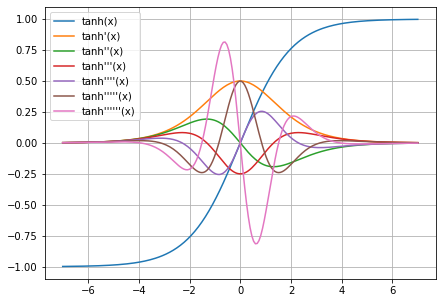

# Easygrad
An easy, extensible, Numpy-based **automatic differentiation** tool, adapted from [Autodidact](https://github.com/mattjj/autodidact) and [Autograd](https://github.com/hips/autograd).

A complete but a little messy [jupyter tutorial](notebooks/Easygrad.ipynb).



## Difference of Easygrad

- Less code: This re-implementation is composed of **< 300 lines** of code, which is better for learning features of autodiff. Autodidact has 700 lines and Autograd has 3000 lines.
- Fixed bug: Autodidact is a pedagogical implementation of Autograd, which leads to reduction of many code but also some bugs. Ex: `grad(grad(lambda x: 2 / x))(np.array([1]))` goes wrong in Autodidact but well in Easygrad.

## More details

1. Easygrad doesn't wrap all Numpy functions directly but instead wrap the functions that invoke them, which might be the reason for fixing some bugs.
2. Only some basic functions (add, sub, exp, sin, ...) are implemented for tutorial, which can be easily extended if needed.
3. Similar to Autograd, Easygrad also adopt `Box` to help flag the variables we're taking the gradient with respect to and differentiate backward path (computation graph) of different derivative (first/second/... derivative).
4. Similar to Autograd, Easygrad wrap functions with `primitive`, which is helpful for doing real computation with variables within multiple nested boxes and reducing redundent codes of stripping each `box`.

## Q&A
- Why is `__array_priority__ > 0` important?

  - For `ArrayBox(np.array([1,2]), 0, None) / np.array([1, 2])`, `ArrayBox.__truediv__` is invoked; we get an answer of `ArrayBox with value array([1., 1.])`, which is correct.

  - For `np.array([1, 2]) / ArrayBox(np.array([1,2]), 0, None)`, `ArrayBox.__rtruediv__` is **NOT** invoked; instead, `np.ndarray.__truediv__` is invoked, and we get `array([ArrayBox, ArrayBox])`, where the first `ArrayBox with array([1. , 0.5])` & second `ArrayBox with array([2., 1.])`. That's why everything goes wrong.

- Why is `TraceStack` important?

  - For a simple code below, `grad(f)(5.)` wraps `5.` in a `Box` and calls `f(Box(5))`. Then, `grad(g)(x)` wraps `Box(5)` again and calls `g(Box(Box(5))`.
  - Function `g(y)` does calculation of `x*y`, where `x=Box(5.)` and `y=Box(Box(5.))`, for which `x=Box(5.)` is fixed and does not need gradient.
  - `TraceStack` generates incremental number as `trace_id`, which is `1` for `y` and `0` for `x`. That's how `primitive` function differentiate these things.

```python
# A brief example code form Autodidact
def f(x):
  def g(y):
    return x * y
  return grad(g)(x)

y = grad(f)(5.)
```

## Acknowledgement

Thanks for [Matt Johnson](https://github.com/mattjj)'s great tutorial of [Autodidact](https://github.com/mattjj/autodidact) and a much more advanced version of [Autograd](https://github.com/hips/autograd).
